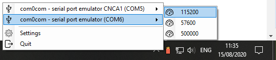
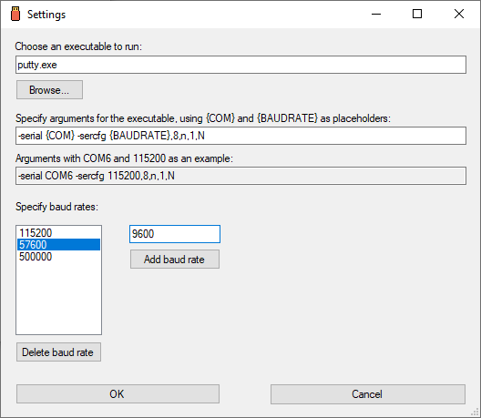

# SerialPop
[](https://github.com/alk0ve/SerialPop/blob/master/LICENSE.md)
[](https://github.com/alk0ve/SerialPop/issues)


Get a pop up whenever a [serial port](https://en.wikipedia.org/wiki/Serial_port) connects to or disconnects from your machine.
Connect to a serial port with just three mouse clicks using your favourite tool.




## Table of Contents
* [Installation and Usage](#installation-and-usage)
* [Reporting bugs or requesting features](#reporting-bugs-or-requesting-features)
* [Source Code and Building](#source-code-and-building)
* [How to test](#how-to-test)
* [Known issues](#known-issues)
* [Future and Roadmap](#future-and-roadmap)
* [Contributing](#contributing)


## Installation and Usage
### Installing and running for the first time
There is no explicit installtion step, just grab the [latest release from the repo](https://github.com/alk0ve/SerialPop/releases), unpack it and run. To make sure it runs without errors, you can either right-click on the SerialPop task bar icon (and see a menu that looks like the one in the screenshot above), or connect or disconnect a serial device to have SerialPop generate a notification.

Once SerialPop runs, you should open the Settings tab to define how you want to connect to serial ports by specifying the tool you want to run and its arguments, with optional placeholders **{COM}** and **{BAUDRATE}**, which will be replaced by SerialPop with the serial port address and baud rate you click on in the context menu (there's an example of what your arguments look like *after* replacing the placeholders with sample values).

### Usage
SerialPop does two things: it displays notifications whenever you connect or disconnect a serial device from your machine, and it allows you to quickly connect to any available serial port via the context (right-click) menu.

In order to connect to a serial device you need to first point to the executable you want to use (*putty.exe*'s path, for example), and then specify its arguments, where you can use the placeholders **{COM}** and **{BAUDRATE}**. When you click on a specific menu entry SerialPop will use that entry's COM port address and baud rate instead of the placeholders. The Settings form also includes an example that demonstrates how your arguments will end up after replacing the placeholders.



### Quality of life improvements
There are three things you should probably do in order to get the most out of SerialPop:
* Populate the baud rate list with the baud rates you usually see (the two most common ones are 57600 and 115200, but this very much depends on the device you're dealing with)
* Make SerialPop always visible in your taskbar (on the current Windows 10 you need to right-click the taskbar --> Taskbar Settings --> scroll down to Notification area --> *Select which icons appears on the taskbar* --> click *On* in the SerialPop row)
* Make SerialPop run on startup (last time I checked you could add a shortcut to SerialPop in *C:\Users\[your user name]\AppData\Roaming\Microsoft\Windows\Start Menu\Programs\Startup*)

Note that your settings are stored in *config.xml*, in the same folder as SerialPop itself (which means that it should have enough permissions to create the file).
The configuration file's format is simple, and typically looks similar to this:
```xml
<?xml version="1.0" encoding="utf-8"?>
<ConfigurationStruct xmlns:xsi="http://www.w3.org/2001/XMLSchema-instance" xmlns:xsd="http://www.w3.org/2001/XMLSchema">
  <ExecutablePath>putty.exe</ExecutablePath>
  <Arguments>-serial {COM} -sercfg {BAUDRATE},8,n,1,N</Arguments>
  <BaudRates>
    <int>115200</int>
    <int>57600</int>
    <int>500000</int>
  </BaudRates>
</ConfigurationStruct>
```


### Errors and issues
In general, whenever SerialPop encounters an error it will create a notification with the exception message. There is one exception to this rule: if SerialPop can't get the address of a serial port it will disable its menu entry - it will appear but you won't be able to connect to that device. This usually means that the APIs SerialPop relies on for COM port addresses and descriptions were out of sync.

A quick note: if you specify just one baud rate you won't see a nested menu (since there's no need to choose a baud rate). In this case, clicking on the port entry will directly launch the tool you specified in Settings.


## Reporting bugs or requesting features
If you find any bugs or issues - please [create an issue](https://github.com/alk0ve/SerialPop/issues), and make sure you include instructions for reproducing the issue; I'll try to fix it as soon as possible.

If you have suggestions for features you'd like to see in SerialPop you can create and issue detailing your idea, and I might get around to implementing it, depending on how much public interest there is (and how much I personally think it's a good idea).


## Source Code and Building
### Building
There are no external dependencies, so all you need to do to build SerialPop is to open the solution in Visual Studio and click "Build Solution".

At the moment (due to some internal dependencies, I'm guessing) you have to build the solution *before* you can open the Settings form in the Designer.

### Source code structure
The solution is split into three projects: **TestConsole** (which I'm using for experimentation), **shared** (a library containing code that might be reused in the future) and **SerialPop** (which contains the application and UI logic). shared contains two useful classes, the first being *Serial*, which queries the system for information about serial ports using two different APIs: [WMI](https://en.wikipedia.org/wiki/Windows_Management_Instrumentation) and the C# SerialPort class (which internally queries the Windows Registry).

The second class in shared is *Configuration*, which handles (de)serialization of the configuraiton file into XML.

Internally, SerialPop runs in two threads: a standard C# UI thread, and a polling thread that uses *shared.Serial*.


## How to test
There are two useful tricks you could use to test SerialPop:
1. Use **dummy.bat** as the executable you use to connect to serial ports - dummy.bat prints all of its arguments and then waits for you to hit Enter, and it's a decent way of making sure your arguments to your tool of choice are correct.
2. Use [com0com's ](http://com0com.sourceforge.net/) **setupg.exe** (UI) or **setupc.exe** (command line) utilities to create new virtual COM ports (you might have to enable "use Ports class"), it might be easier than plugging in actual hardware.

## Known issues
1. The 0.3 release is flagged by at least two antivirus software (according to VirusTotal), I already submitted the executables to both as false positives. This affects both the release and debug versions of SerialPop, there isn't much I can do at the moment. If you encounter this issue please build the tag corresponding to the latest release (that's the 0.3 tag at the moment), the build time is less than a minute.


## Future and Roadmap
1. Add a way to make SerialPop run at startup to the Settings form.
2. Add an installer with initial options (findings putty.exe, running at startup).
3. Refactor SerialPop into a service that monitors serial port connections and pushes notifications whenever there's been a change, and a UI that subscribes to that service. I think this approach will make my code much easier to reuse once there's a well defined API for receiving notifications, and other tools might be built on top of that.


## Contributing
There are three ways you can show appreciation for this project or contribute to it
* [Buy me a coffee:coffee:](https://ko-fi.com/alk0ve) (also under 'Sponsor this project' to your right)
* [Report any bugs or issues you find](https://github.com/alk0ve/SerialPop/issues) (and don't forget to include intructions on how to them)
* If you want to help me implement more features or refactor the source code - get in touch with me (my email should be visible in my profile)


	
